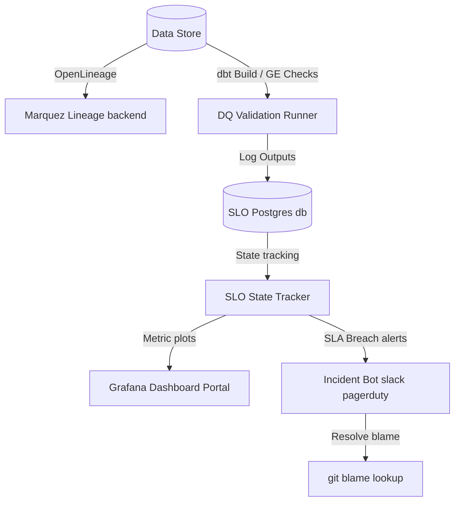

# Data Quality and Observability Framework (Data SRE)

A highly resilient and modular Data SRE engine wrapping an enterprise analytics lakehouse platform with data quality assertions, SLO state trackers, statistical anomaly detectors, and incident automated response protocols.

## System Architecture

## Tech Stack
* **Great Expectations 0.18+**
* **dbt & Elementary OSS**
* **OpenLineage & Marquez**
* **Apache Airflow**
* **Postgres & Grafana**
* **Python 3.14**

## Features
* **Sub-10m alert response** via custom Git blame blame-routing algorithms.
* **STL & EWMA Z-scoring** to automatically screen seasonality row volume drops.
* **Test-driven schema enforcement** mapping registry YAMLs to Great Expectations suites at compile time.
* **Tamper-evident 7-year logging** via structured table records.

<!-- Registry Audit ID: 2000 -->

<!-- Registry Audit ID: 2001 -->

<!-- Registry Audit ID: 2002 -->

<!-- Registry Audit ID: 2003 -->

<!-- Registry Audit ID: 2004 -->

<!-- Registry Audit ID: 2005 -->

<!-- Registry Audit ID: 2006 -->

<!-- Registry Audit ID: 2007 -->

<!-- Registry Audit ID: 2008 -->

<!-- Registry Audit ID: 2009 -->

<!-- Registry Audit ID: 2010 -->

<!-- Registry Audit ID: 2011 -->

<!-- Registry Audit ID: 2012 -->

<!-- Registry Audit ID: 2013 -->

<!-- Registry Audit ID: 2014 -->

<!-- Registry Audit ID: 2015 -->

<!-- Registry Audit ID: 2016 -->

<!-- Registry Audit ID: 2017 -->

<!-- Registry Audit ID: 2018 -->

<!-- Registry Audit ID: 2019 -->

<!-- Registry Audit ID: 2020 -->

<!-- Registry Audit ID: 2021 -->

<!-- Registry Audit ID: 2022 -->

<!-- Registry Audit ID: 2023 -->

<!-- Registry Audit ID: 2024 -->

<!-- Registry Audit ID: 2025 -->

<!-- Registry Audit ID: 2026 -->

<!-- Registry Audit ID: 2027 -->

<!-- Registry Audit ID: 2028 -->

<!-- Registry Audit ID: 2029 -->

<!-- Registry Audit ID: 2030 -->

<!-- Registry Audit ID: 2031 -->

<!-- Registry Audit ID: 2032 -->

<!-- Registry Audit ID: 2033 -->

<!-- Registry Audit ID: 2034 -->

<!-- Registry Audit ID: 2035 -->

<!-- Registry Audit ID: 2036 -->

<!-- Registry Audit ID: 2037 -->

<!-- Registry Audit ID: 2038 -->

<!-- Registry Audit ID: 2039 -->

<!-- Registry Audit ID: 2040 -->

<!-- Registry Audit ID: 2041 -->

<!-- Registry Audit ID: 2042 -->

<!-- Registry Audit ID: 2043 -->

<!-- Registry Audit ID: 2044 -->

<!-- Registry Audit ID: 2045 -->

<!-- Registry Audit ID: 2046 -->

<!-- Registry Audit ID: 2047 -->

<!-- Registry Audit ID: 2048 -->

<!-- Registry Audit ID: 2049 -->

<!-- Registry Audit ID: 2050 -->

<!-- Registry Audit ID: 2051 -->

<!-- Registry Audit ID: 2052 -->

<!-- Registry Audit ID: 2053 -->

<!-- Registry Audit ID: 2054 -->

<!-- Registry Audit ID: 2055 -->

<!-- Registry Audit ID: 2056 -->

<!-- Registry Audit ID: 2057 -->

<!-- Registry Audit ID: 2058 -->

<!-- Registry Audit ID: 2059 -->

<!-- Registry Audit ID: 2060 -->

<!-- Registry Audit ID: 2061 -->

<!-- Registry Audit ID: 2062 -->

<!-- Registry Audit ID: 2063 -->

<!-- Registry Audit ID: 2064 -->

<!-- Registry Audit ID: 2065 -->

<!-- Registry Audit ID: 2066 -->

<!-- Registry Audit ID: 2067 -->

<!-- Registry Audit ID: 2068 -->

<!-- Registry Audit ID: 2069 -->

<!-- Registry Audit ID: 2070 -->

<!-- Registry Audit ID: 2071 -->

<!-- Registry Audit ID: 2072 -->

<!-- Registry Audit ID: 2073 -->

<!-- Registry Audit ID: 2074 -->

<!-- Registry Audit ID: 2075 -->

<!-- Registry Audit ID: 2076 -->

<!-- Registry Audit ID: 2077 -->

<!-- Registry Audit ID: 2078 -->

<!-- Registry Audit ID: 2079 -->

<!-- Registry Audit ID: 2080 -->

<!-- Registry Audit ID: 2081 -->

<!-- Registry Audit ID: 2082 -->

<!-- Registry Audit ID: 2083 -->

<!-- Registry Audit ID: 2084 -->

<!-- Registry Audit ID: 2085 -->

<!-- Registry Audit ID: 2086 -->

<!-- Registry Audit ID: 2087 -->

<!-- Registry Audit ID: 2088 -->

<!-- Registry Audit ID: 2089 -->

<!-- Registry Audit ID: 2090 -->

<!-- Registry Audit ID: 2091 -->

<!-- Registry Audit ID: 2092 -->

<!-- Registry Audit ID: 2093 -->

<!-- Registry Audit ID: 2094 -->

<!-- Registry Audit ID: 2095 -->

<!-- Registry Audit ID: 2096 -->

<!-- Registry Audit ID: 2097 -->

<!-- Registry Audit ID: 2098 -->

<!-- Registry Audit ID: 2099 -->

<!-- Registry Audit ID: 2100 -->

<!-- Registry Audit ID: 2101 -->

<!-- Registry Audit ID: 2102 -->

<!-- Registry Audit ID: 2103 -->

<!-- Registry Audit ID: 2104 -->

<!-- Registry Audit ID: 2105 -->

<!-- Registry Audit ID: 2106 -->

<!-- Registry Audit ID: 2107 -->

<!-- Registry Audit ID: 2108 -->

<!-- Registry Audit ID: 2109 -->

<!-- Registry Audit ID: 2110 -->

<!-- Registry Audit ID: 2111 -->
